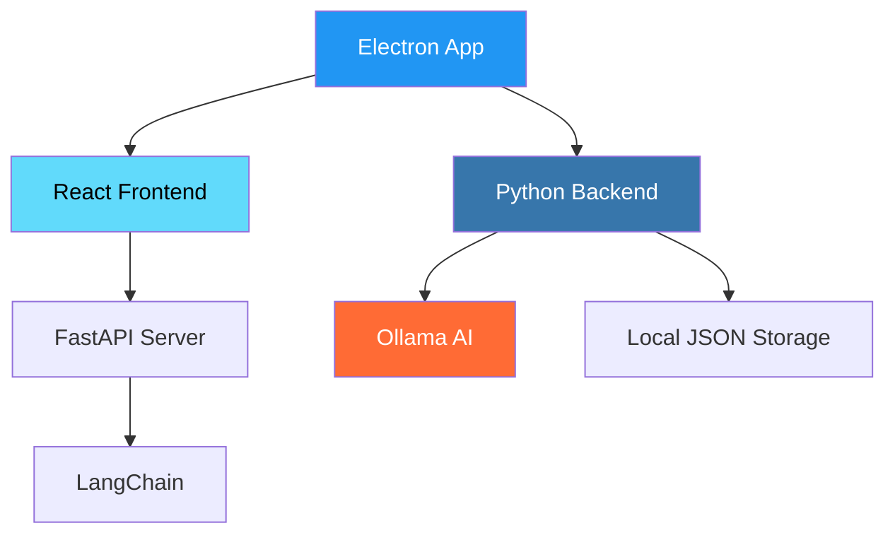

# MindWell - Your Offline AI-Powered Therapy Assistant

<div align="center">


**Your personal AI-powered assistant for mental wellness and productivity**

[](https://opensource.org/licenses/MIT)
[](https://www.electronjs.org/)
[](https://reactjs.org/)
[](https://www.typescriptlang.org/)
[](https://www.python.org/)
[](https://fastapi.tiangolo.com/)
[](https://ollama.com/)

[](https://github.com/MirangBhandari/MindWell/releases)


[📥 Download](https://github.com/MirangBhandari/MindWell/releases) • [📖 Documentation](#) • [🐛 Report Bug](https://github.com/MirangBhandari/MindWell/issues) • [💡 Request Feature](https://github.com/MirangBhandari/MindWell/issues)

</div>

---

## 🌟 Overview

MindWell is a powerfu lcompletely offline desktop application utilizing Gemma3n as the brains behind the operation, designed to be your personal AI-powered Therapy assistant, with a special focus on mental wellness tracking, journaling and summarization. Built with privacy in mind, it runs completely offline with its own SQLLite database, ensuring your data remains secure on your machine and only you have access to it. Experience the power of Gemma3n and AI without compromising your privacy.

> 🔒 **Privacy First**: All your data stays on your device. No cloud storage, no data sharing.

---

## ✨ Key Features

### 🤖 **Gemma3n Powered Chat**
Interact with a powerful local AI assistant from Google (Gemma3n model via Ollama) for various tasks including:
- Question answering
- Re-affirmations
- Wellness tracking
- Storing Special Memories
- Journaling
- Language Switching
- Exporting or accessing your database
- and a lot more planned...

### 😊 **Mood Tracking & Analytics**
- Log daily moods with detailed entries
- Interactive mood trend visualizations
- Insightful summaries over time
- Pattern recognition and insights

### 🎯 **Memory Lane**
- Any special memories tagged by Gemma3n are stored in Memory lane
- Allows users to Journal, modify the memory on command
- Revisit old memories with timestamps
- Delete Memories on command

### 🔧 **Customization & Accessibility**
- Personalized settings and themes
- User name setting to utilize as context for the chat app
- default langugae settings to get summarization and journaling in different languages
- Adaptive UI design and interactive animations

---

## 🏗️ Architecture & Tech Stack

<div align="center">



</div>

### 🛠️ Technologies Used

| **Category** | **Technologies** | **Purpose** |
|--------------|------------------|-------------|
| **Frontend** |    | User Interface & Experience |
| **UI/UX** |   | Data Visualization & Animations |
| **Backend** |   | API & Business Logic |
| **AI/ML** |   | Local AI Processing |
| **Desktop** |  | Cross-platform Desktop App |
| **Build Tools** |   | Application Packaging |

---

## 🚀 Quick Start

### Prerequisites

- **Node.js** (v18 or higher)
- **npm** or **yarn**
- **Git**

### Installation

1. **Clone the repository**
   ```bash
   git clone https://github.com/MirangBhandari/MindWell.git
   cd MindWell/electron-app
   ```

2. **Install dependencies**
   ```bash
   npm install
   ```

3. **Start development environment**
   ```bash
   npm run dev
   ```
   
   This command will:
   - 🚀 Start the React development server
   - 🖥️ Launch the Electron application
   - 🐍 Initialize the Python backend
   - 🤖 Connect to the local Ollama instance

### First Run Setup

1. **Install Ollama** (if not already installed)
   - Visit [ollama.ai](https://ollama.ai) and follow installation instructions
   - Pull the Gemma model: `ollama pull gemma`

2. **Launch MindWell**
   - The application will automatically detect your Ollama installation
   - Complete the initial setup wizard
   - Start exploring your new AI assistant!

---

## 📦 Build & Distribution

### Building for Production

| Platform | Command | Output |
|----------|---------|--------|
| **Windows** | `npm run dist:win` | `.exe` installer |
| **macOS** | `npm run dist:mac` | `.dmg` installer |
| **Linux** | `npm run dist:linux` | `.AppImage` / `.deb` |

Built applications will be available in `electron-app/dist/`

### Build Features

- 📦 **Standalone Executables**: No Python installation required
- 🔧 **Custom NSIS Installer**: Professional Windows installation experience
- 🍎 **macOS Code Signing**: Ready for distribution (certificate required)
- 🐧 **Linux AppImage**: Universal Linux compatibility

---

## 🛣️ Development Roadmap

### ✅ Completed

- [x] Core Electron application setup
- [x] React-based UI with TypeScript
- [x] FastAPI backend integration
- [x] Ollama AI integration
- [x] Mood tracking with Chart.js visualizations
- [x] Goal management system
- [x] Digital journaling (Memory Lane)
- [x] Wellness tracking
- [x] Cross-platform build system
- [x] Python-less packaging

### 🚧 In Progress

- [ ] Advanced AI conversation memory
- [ ] Data export/import functionality
- [ ] Customizable themes
- [ ] Plugin system architecture

### 🔮 Future Plans

- [ ] Cloud sync (optional, encrypted)
- [ ] Mobile companion app
- [ ] Advanced analytics dashboard
- [ ] Integration with wearable devices
- [ ] Voice interaction capabilities

---

## 🤝 Contributing

We welcome contributions from the community! Here's how you can help:

1. **🍴 Fork the repository**
2. **🌿 Create a feature branch** (`git checkout -b feature/amazing-feature`)
3. **💻 Make your changes**
4. **✅ Run tests** (`npm test`)
5. **📝 Commit your changes** (`git commit -m 'Add amazing feature'`)
6. **🚀 Push to the branch** (`git push origin feature/amazing-feature`)
7. **🔀 Open a Pull Request**

### Development Guidelines

- Follow the existing code style
- Write clear commit messages
- Add tests for new features
- Update documentation as needed

---

## 📄 License

This project is licensed under the **MIT License** - see the [LICENSE](LICENSE) file for details.

---

## 🙏 Acknowledgments

- **Ollama Team** for the amazing local AI infrastructure
- **Electron Community** for the powerful desktop framework
- **React & FastAPI Teams** for the robust development tools
- **Open Source Community** for inspiration and support

---

<div align="center">

**Made with ❤️ for mental wellness and productivity**

[⭐ Star this project](https://github.com/MirangBhandari/MindWell) if you find it helpful!

</div>
